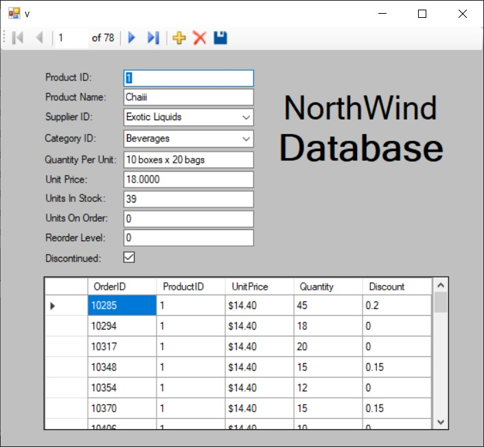

# CPRG-200-Lab-3

Create a Windows Forms application that connects to the Northwind database using data source that
includes tables: Products and Order Details.

On the form, all data from Products should be displayed in detail form, with text boxes for all columns,
except for SupplierID and CategoryID, which should be bound to a combo boxes to allow user to pick
supplier and category, rather than type data in text boxes. 

Use CategoryName and CompanyName from
the related tables Categories and Suppliers for display in the combo boxes, but set value members to
the IDs.

